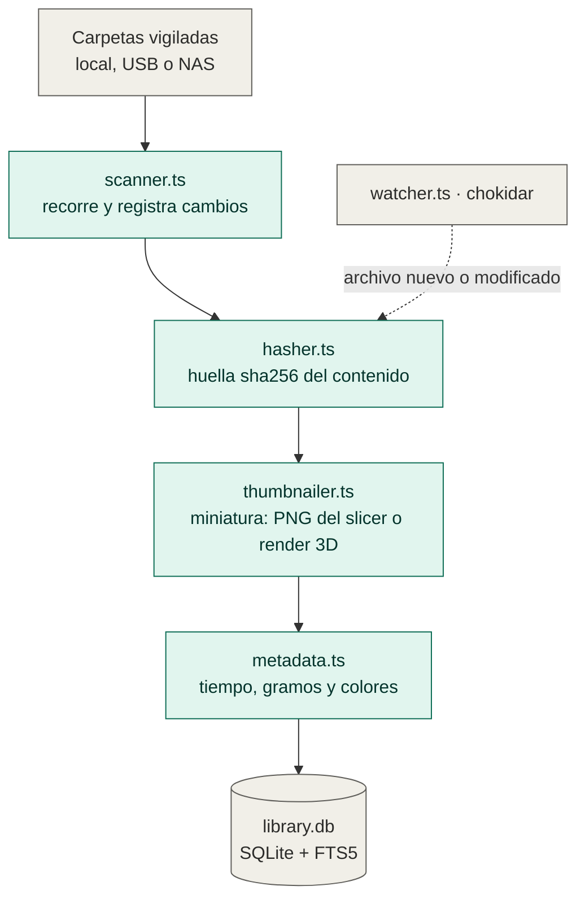
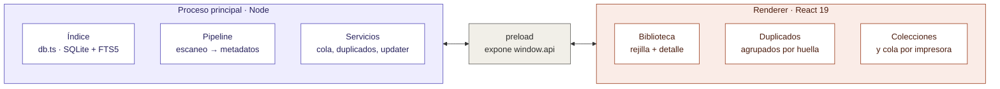

# Layer Library

Biblioteca **local** para archivos de impresión 3D (STL, 3MF, …): miniaturas reales,
búsqueda instantánea, detección de duplicados y cola de impresión. Inspirada en
[LayerMate](https://www.layermate.app/). Nada sale de tu equipo.

## Stack

- **Electron 38** + `electron-vite`
- **React 19** + TypeScript (renderer)
- **`node:sqlite`** con FTS5 (índice y búsqueda) — sin módulos nativos que compilar
- **chokidar** (escaneo incremental + watch)
- **three** (render de miniaturas STL en ventana oculta)

## Cómo funciona

Indexar es una cadena de cuatro etapas que se encadenan solas: cada una llama a la
siguiente en su última línea, sin orquestador. Todas son idempotentes y se
auto-deduplican, así que da igual cuántas veces se disparen.



Dos atajos que no se ven en el diagrama:

- **El thumbnailer aprovecha el buffer.** Cuando abre un 3MF para sacar la
  miniatura, extrae de paso el tiempo y los gramos; así `metadata.ts` solo tiene
  que ocuparse del backfill de lo que ya estaba indexado.
- **El relaminado no está en la cadena.** Es una rama bajo demanda: sale del botón
  del panel de detalle y va a `slicer.ts`, que lanza el CLI de Bambu Studio en una
  cola de uno en uno. No es automático porque cuesta un par de minutos por archivo.

## Instalación

Descarga el instalador de la [última release](https://github.com/xDomiinz22/layer-library/releases/latest)
y ejecútalo. Al no estar firmado, Windows SmartScreen avisará: **Más información →
Ejecutar de todas formas**.

A partir de ahí la app **se actualiza sola**: comprueba las releases de GitHub al
arrancar (y cada 6 h), descarga la nueva versión en segundo plano y muestra en el
pie de la barra lateral un botón para reiniciar e instalarla. Si no reinicias, se
instala al cerrar la app.

## Desarrollo

```bash
npm install
npm run dev          # app con HMR
npm run dist         # instalador local -> dist/Layer Library-<v>-setup.exe
```

Sin dependencias nativas: no hace falta toolchain de C++.

## Publicar una versión nueva

1. Sube el número en `package.json` (`version`).
2. Publica:

   ```bash
   GH_TOKEN=$(gh auth token) npm run release
   ```

   Compila y sube a GitHub una release con el `.exe`, su `.blockmap` y el
   `latest.yml` que el auto-updater necesita. Revisa/edita las notas de la
   release en GitHub después.

## Formatos

| Formato | Indexado | Miniatura |
|---|---|---|
| STL, OBJ | ✅ | render Three.js |
| 3MF | ✅ | PNG embebida del slicer (si no, render) |
| GCODE | ✅ | PNG embebida del slicer |
| STEP / STP | ✅ | — (sin kernel CAD) |

## Estructura

Las tres capas de Electron. Todo lo que toca disco vive en el principal; el
renderer solo pinta, y `preload` es la única puerta entre ambos. Las llamadas van
hacia la derecha y los eventos (`library:changed`, `scan:progress`) vuelven, que es
lo que hace que las miniaturas aparezcan solas sin refrescar nada.



```
src/
  main/      proceso principal: ventana, DB, IPC, escaneo (Node)
  preload/   puente contextIsolation -> window.api
  renderer/  UI React
  shared/    tipos compartidos main <-> renderer
```

## Roadmap

- [x] **Fase 0** — Scaffold, ventana, DB, alta/baja de carpetas raíz (locales, externas, red)
- [x] **Fase 1** — Escaneo recursivo STL/3MF, indexado incremental, hashing (sha256), watch en vivo
- [x] **Fase 2** — Miniaturas: PNG embebido de 3MF + render STL/3MF con Three.js, cola en segundo plano, grid de tarjetas
- [x] **Fase 3** — Cuadrícula virtualizada, filtros (formato/biblioteca/fecha/duplicados), panel de detalle con metadatos de malla
- [x] **Fase 4** — Vista de duplicados + borrado a Papelera, cola de impresión por impresora, colecciones/creadores
- [x] **Fase 5** — OBJ (render) · GCODE (miniatura embebida) · STEP (indexado), limpieza de caché, icono, instalador NSIS (`npm run dist`)
- [x] **Fase 6** — Metadatos de impresión: colores, tiempo y gramos leídos del 3MF/G-code, sumando todos los platos; orden por tiempo y por filamento
- [x] **Fase 7** — Relaminado bajo demanda con el CLI de Bambu Studio / OrcaSlicer para los archivos que no traen datos, y auto-actualización contra las releases de GitHub
